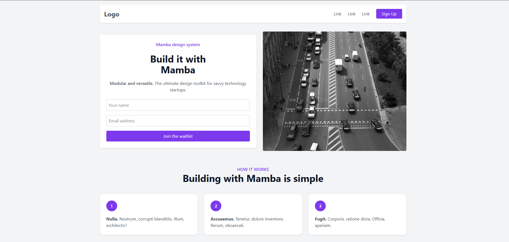
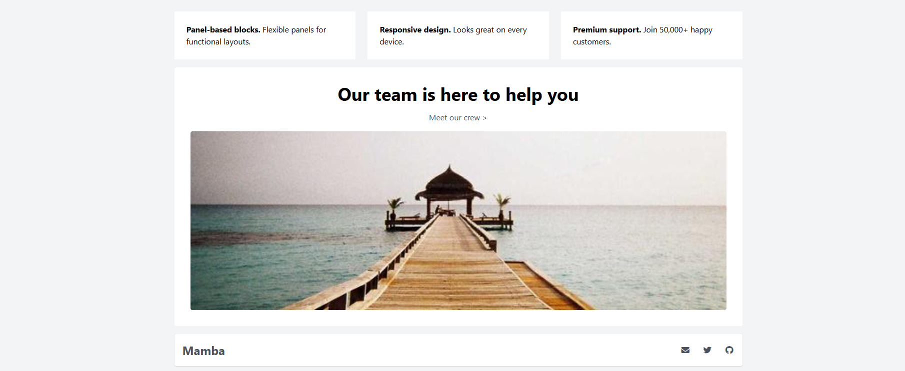

# Mamba Landing Page (Tailwind CSS)

Bu proje, **Tailwind CSS** kullanılarak oluşturulmuş tamamen **responsive (mobil–tablet–masaüstü uyumlu)** bir tanıtım (landing) sayfasıdır.

## Özellikler

- Tam responsive yapı (flex & grid sistemleri)
- Modern ve sade tasarım
- Tailwind CSS ile hızlı özelleştirme
- Yeniden kullanılabilir bileşen yapısı
- Mobilde dikey, masaüstünde yatay hizalama

## Kullanılan Teknolojiler

- **HTML5**
- **Tailwind CSS v3+**
- **Font Awesome (ikonlar için)**
- **Google Fonts (Roboto, varsayılan)**

## Dosya Yapısı

Odev-1/
│
├── landingpage.html # Ana sayfa
└── README.md # Proje dokümantasyonu

##  Bölümler

1. **Header (Navigation)**  
   - Logo, bağlantılar ve “Sign Up” butonu

2. **Hero Section**  
   - Başlık, açıklama, form ve görsel

3. **How It Works Section**  
   - 3 adımlı açıklama kutuları

4. **Testimonial (Yorum Bölümü)**  
   - Kullanıcı yorumu ve görsel

5. **Business Section**  
   - Görsel ve metin hizalı (grid yapısı, eşit yükseklik)

6. **Features Section**  
   - Üç sütunlu açıklama kutuları

##  Ekran Görüntüsü

