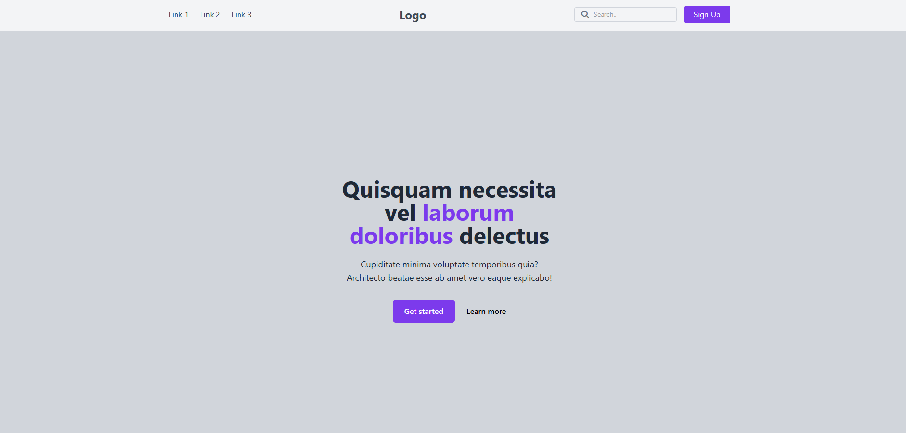
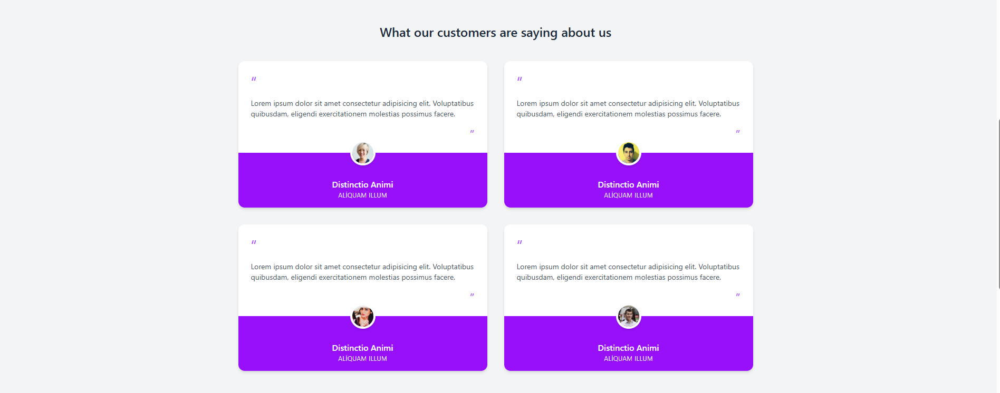
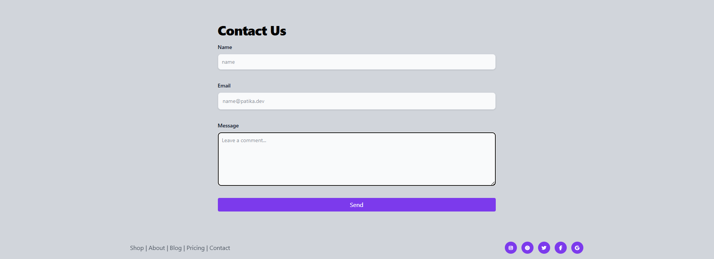

# 🌐 TailwindCSS Review Page

Bu proje, **TailwindCSS** kullanılarak oluşturulmuş modern, responsive bir “Review / Landing Page” örneğidir.  
Sayfa; başlık (header), kahraman alanı (hero section), müşteri yorumları (testimonial grid), iletişim formu (contact form) ve alt bilgi (footer) bölümlerinden oluşur.

## Teknolojiler

Projede kullanılan başlıca teknolojiler:
- **HTML5** – Temel yapı iskeleti
- **TailwindCSS** – Modern ve esnek CSS framework
- **Font Awesome 7.0.1** – İkon seti (sosyal medya ve arama ikonları)
- **CDN bağlantıları** – Harici kütüphaneler için

## Bölüm Yapısı

1. **Header (Navigasyon Menüsü):**
   - Sol kısımda menü linkleri
   - Orta kısımda logo
   - Sağda arama kutusu ve “Sign Up” butonu

2. **Hero Bölümü:**
   - Büyük başlık, açıklama metni ve iki CTA (Get Started / Learn More) butonu
   - Arka plan gri tonlarında, ortalanmış içerik

3. **Testimonial (Müşteri Yorumları):**
   - 4 adet kart yapısı (grid sistemi)
   - Kullanıcı fotoğrafları, isim ve kısa yorum metinleri
   - Modern kart gölgesi ve mor vurgu rengi (#7C3AEC)

4. **Contact Form:**
   - İsim, e-posta ve mesaj alanları
   - TailwindCSS odak efektleriyle tasarlanmış form alanları
   - “Send” butonu mor tonlu hover efektiyle

5. **Footer:**
   - Sayfa linkleri (Shop, About, Blog, Pricing, Contact)
   - Sosyal medya ikonları (Instagram, Pinterest, Twitter, Facebook, Google)
   - Mobilde dikey, masaüstünde yatay hizalama

## 📱 Responsive Tasarım

- Mobil ve masaüstü cihazlara göre otomatik uyarlanır.  
- `flex`, `grid` ve `responsive utility classes` kullanılmıştır.  
- 640px altındaki cihazlarda bile optimize görünüm sağlar.

##  Ekran Görüntüsü

