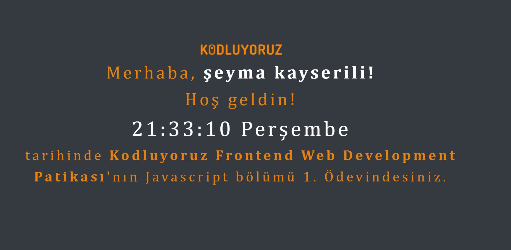

## Kodluyoruz JavaScript Saat Ödevi 🕒

Bu proje, Kodluyoruz Frontend Web Development Patikası kapsamında hazırlanan JavaScript Saat Ödevidir.
Kullanıcının adını alır, ekrana kişisel bir karşılama mesajı ve gerçek zamanlı olarak güncellenen saati gösterir.

## Amaç

Bu ödevin amacı, JavaScript ile:

Kullanıcıdan veri almak (prompt),

DOM üzerinde içerik değiştirmek,

Dinamik saat ve tarih göstermek,

Basit zaman işlevleri (setInterval) uygulamalarını öğrenmektir.

## Özellikler

Kullanıcıdan isim alır ve ekrana yazar.

Saat ve tarih bilgisi her saniye güncellenir.

Şık bir arayüz için Bootstrap 4.6 ve özel CSS stilleri kullanılmıştır.

Tamamen tarayıcı üzerinde çalışır, ekstra bir kurulum gerektirmez.

## Canlı Önizleme

Projeyi yerel olarak çalıştırıp tarayıcıda açarak test edebilirsiniz, lütfen <a href="https://seymakayserili.github.io/patika.dev/Hafta-5/Odev-1_Karsilama/">tıklayınız.</a>

## Dosya Yapısı

/
├── index.html
├── css/
│   └── style.css
├── js/
│   └── clock.js
└── README.md

##  Ekran Görüntüsü

