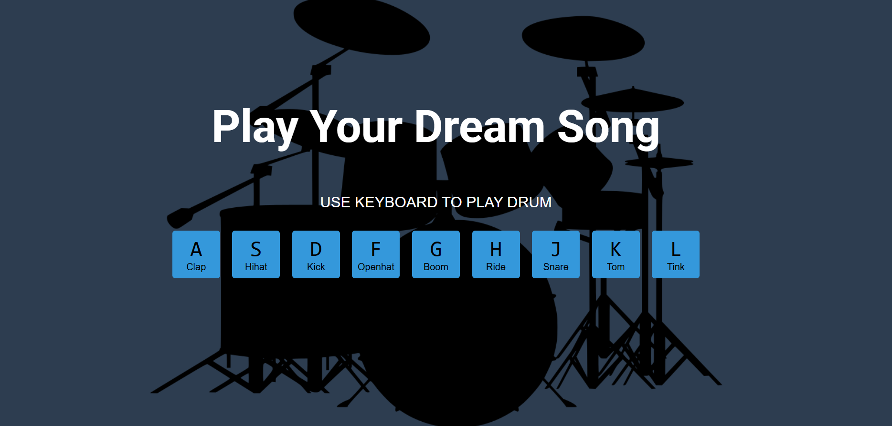

## Javascript Drum Kit

Basit, öğrenmesi keyifli ve etkileşimli bir mini davul seti projesi. Klavyedeki A — L tuşlarına basarak farklı davul seslerini çalabilirsiniz. Öğrenme amaçlı, küçük front-end projelerine örnek olması ve JavaScript ile DOM / audio kullanımı öğrenmek için idealdir.

## Özellikler

Klavye ile davul çalma (A, S, D, F, G, H, J, K, L).

Her tuşa karşılık gelen .wav ses dosyalarını oynatma.

HTML/JS/CSS ile kolayca özelleştirilebilir yapı.

## Canlı Önizleme

Projeyi yerel olarak çalıştırıp tarayıcıda açarak test edebilirsiniz. Lütfen <a target="_blank" href="https://seymakayserili.github.io/patika.dev/Hafta-5/Odev-2/">tıklayınız.</a> 

## Dosya Yapısı

/
├─ index.html
├─ css/
│  └─ style.css
├─ js/
│  └─ script.js
├─ sounds/
│  ├─ clap.wav
│  ├─ hihat.wav
│  ├─ kick.wav
│  ├─ openhat.wav
│  ├─ boom.wav
│  ├─ ride.wav
│  ├─ snare.wav
│  ├─ tom.wav
│  └─ tink.wav
└─ README.md

## Tuş Eşleştirmesi

Aşağıdaki eşleştirme HTML'de data-key özniteliği ile belirlenmiştir (ASCII kodu):

Tuş	KeyCode	Ses
A	65	clap
S	83	hihat
D	68	kick
F	70	openhat
G	71	boom
H	72	ride
J	74	snare
K	75	tom
L	76	tink

##  Ekran Görüntüsü

  

