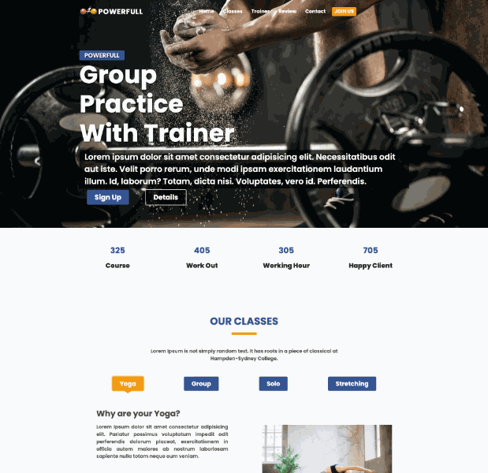

🌟 POWERFULL – Sport Center

Modern, responsive ve kullanıcı dostu bir spor merkezi web sitesi.

    

Bu proje; navbar, hero banner, class selection, BMI hesaplama, trainer tanıtımları, ürün kartları, müşteri yorumları, iletişim formu gibi bir spor merkezi sitesinde olması gereken neredeyse her bölümü içerir.

📸 Proje Önizlemesi

Ön izleme :   
<a href="https://ephemeral-sawine-bfc12d.netlify.app/">Canlı Demo</a>

  
🚀 Özellikler

✔️ Responsive Tasarım
Mobil, tablet ve masaüstü uyumlu tamamen responsive yapı.

✔️ Modern UI/UX
Gradient arkaplanlar
Hover animasyonları
Kayan navbar
Renk uyumu ve gölge efektleri

✔️ Dinamik Bölümler
Classes Section → Buton ile içerik değiştirme
BMI Calculator → Hesaplama + animasyonlu pointer
Hamburger Menü → Mobil uyumlu açılır kapanır navigasyon

✔️ Ürün Kartları
Modern gölgeli kart tasarımları + hover animasyonu.

✔️ Google Maps Entegrasyonu
İletişim bölümünde gömülü harita.

📂 Proje Yapısı

📁 Sport_Center_Project
│── index.html
│── style.css
│── script.js
└── /img

🧮 BMI Hesaplama

Formdan boy ve kilo girildiğinde BMI değeri hesaplanıp scale üzerinde pointer animasyonu ile gösterilir.

| Teknoloji        | Açıklama                                                     |
| ---------------- | ------------------------------------------------------------ |
| **HTML5**        | Sayfa yapısı ve semantik elementler                          |
| **CSS3**         | Grid, flex, animasyonlar, responsive tasarım                 |
| **JavaScript**   | Dinamik içerik, BMI hesaplama, navbar scroll, hamburger menu |
| **Google Fonts** | Open Sans & Roboto                                           |
| **Font Awesome** | Icon setleri                                                 |

📱 Responsive Görünüm
<ul>
<li> Mobil menü</li>
<li> Mobil class layout</li>
<li> Kartların dikey gösterimi</li>
<li> Uyumlu BMI bölümü</li>
<li> Küçük ekranlar için optimize edilmiş hero yazıları</li>
</ul>

⚙️ Nasıl Çalıştırılır?
<ol>
<li> Bu projeyi indir</li>
<li> Dosyaları bilgisayarında aç</li>
<li> index.html dosyasını çift tıkla</li>
<li> Tarayıcıda otomatik açılır → 🎉 Projen hazır!</li>
</ol>

🤝 Katkıda Bulunma

Projeyi geliştirmek istersen PR açabilirsin.
Star ⭐ bırakmayı unutma!

👤 Geliştirici

Şeyma Kayserili
💬 Front-End Development yolculuğunun ilk projesi!